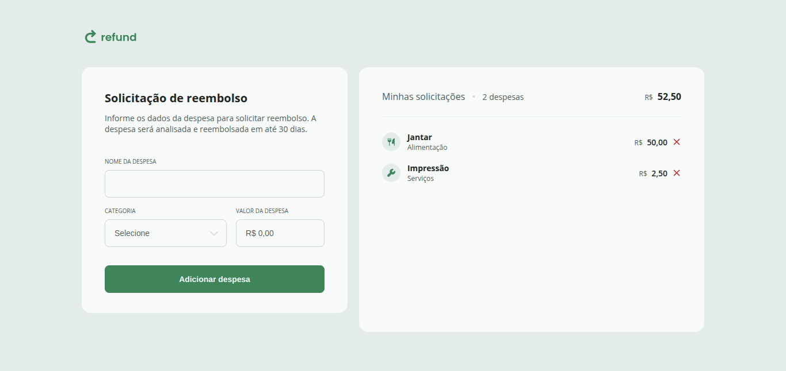

<h1 align="center">Refund: Sistema de reembolso</h1>

> Formação Full-Stack: JavaScript: JavaScript Intermediário.

Refund é uma plataforma web para solicitação de reembolsos e gestão de despesas de viagens corporativas.

[🔗 Clique aqui para acessar](https://fel1324.github.io/Refund/)

## 🤖 Tecnologias

- HTML e CSS
- JavaScript
- Git e Github

## 💚 Contato

rafael.roberto200618@gmail.com

---

Feito com ♥ by Rocketseat :wave: [Participe da nossa comunidade!](https://discord.gg/rocketseat)